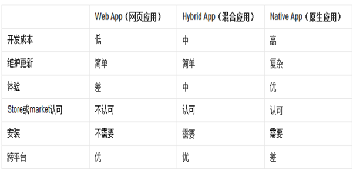
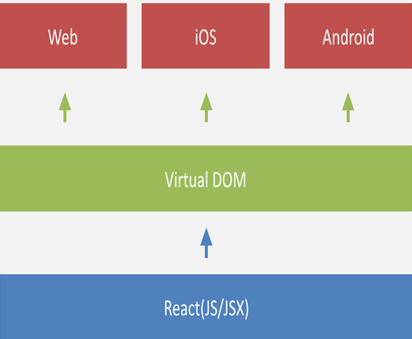

李超 qq984033324

# 混合 APP 开发

## app开发三大主流框架:
1. **WebApp**:就是在浏览器中运行的web应用
2. **NativeApp**:用android和Object-C等原生语言开发的应用
3. **HybridApp**:就是外面是原生的壳，里面是webapp应用，兼具2者的优势

- **混合app的开发方式是未来的主流趋势**

## 移动端开发有哪些框架?
- Ionic
- Html5+
- AppCan
- Framework7
- ...
- Jquery Mobile
- React Native

***

### **Html5+**
[HTML5+官网](http://www.dcloud.io/)
#### 优点：
- 提供了一个自定制的IDE工具，支持非常好，轻量级，甚至不需要安装直接解压缩就可以使用
- 开发出来的app的性能很好，用户体验很高
- 丰富的api支持，号称有40万+

#### 缺点：
- 打包比较麻烦

***

### **React Native**
- [RN官网](https://facebook.github.io/react-native/)
- [RN中文网](http://react-native.cn/)

React Native里面没有webview，这货不是Hybrid app，里面执行JS是用的 JavascriptCore。
把Native code十来个最基本核心的类（RCTDeviceEventEmitter、RCTRenderingPerf等）、或组件（RCTView、RCTTextField、RCTTextView、RCTModalFullscreenView等）封装成二十来个基本组件（Popover、Listview等）
实现了一套类似css的子集，用来解决样式问题，相当复杂和强大，靠这个才能将Native的核心组件组成JS层的基本组件再组成业务端的业务组件
在React Native中，写JS的工程师解决的是「将基本组件拼装成可用的React组件」的问题，写Native Code的工程师解决的是「提供核心组件，提供足够的扩展性、灵活性和性能」的问题。

#### 优点：
- 不用Webview，彻底摆脱了Webview让人不爽的交互和性能问题。
- 有较强的扩展性，这是因为Native端提供的是基本控件，JS可以自由组合使用。
- 可以直接使用Native原生的「牛逼」动画。
- 可以通过更新远端JS，直接更新app。
#### 缺点：
- 由于最外层是React，初次学习成本高，不像往常的Hybird方案，只要多学几个JS API就可以开始干活了。

***

### **AppCan**
- [AppCan官网](http://www.appcan.cn/)

AppCan.cn开发平台是基于HTML5技术的跨平台移动应用快速开发一体化解决方案。
#### 优点：
- 支持四大主流系统：Android,IOS,Symbian,Windows Phone
- 提供一体化解决方案，方便环境搭建、开发、调试、发布
- 框架自带UI包，包含常用控件样式
- 框架API丰富
- 支持本地打包、云端打包
- 基于密钥的代码加密
- 技术支持相应及时
- 框架对UI、动画渲染进行过优化，反应速度快
#### 缺点：
- 不开源，无法修改、优化底层代码
- 暂不支持自行开发控件/，无法调取android原生功能
- 框架自带功能过多，导致应用安装包偏大。
- 文档偏少
- 部分系统无法使用IDE进行调试
- 只能在服务器端发布，无法在本地发布
- IOS发布，需要将证书上传至服务器

***

### **Framework7**
[Framework7官网](http://framework7.io/)

Framework7 是一款免费开源的移动web开发框架(类似的知名框架有Jquery Mobile,sencha),用以开发IOS7风格、体验的混合移动应用和web应用。如果你需要，它还是一款绝好的移动应用原型框架，用以展示应用的功能细节。
Framework7框架的主要目的是使得开发者能够简单、快速的使用HTML,Javascript,CSS开发IOS风格的webapp和混合本地应用。
- Framework7并不兼容所有平台，只专注于带给用户最好的IOS7体验。

***

### **Ionic**
- [ionic官网](http://ionicframework.com/)
- [ionic中文网](http://www.ionic.wang/)

IONIC 是目前**最有潜力**的一款 HTML5 手机应用开发框架。通过 SASS 构建应用程序，它提供了很多 UI 组件来帮助开发者开发强大的应用。 它使用 JavaScript MVVM 框架和 AngularJS 来增强应用。提供数据的双向绑定，使用它成为 Web 和移动开发者的共同选择。Ionic是一个专注于用WEB开发技术，基于HTML5创建类似于手机平台原生应用的一个开发框架。Ionic框架的目的是从 web的角度开发手机应用，基于PhoneGap的编译平台，可以实现编译成各个平台的应用程序。

#### Ionic框架构成
- CSS框架 - 提供原生 App 质感的 CSS 样式模拟。 ionic 这部分的实现使用了 ionicons 图标样式库。
- JavaScript框架 - 提供移动 Web 应用开发框架。ionic 基于 AngularJS 基础框架开发，遵循 AngularJS 的框架约束；此外 ionic 使用 AngularJS UI Router 实现前端路由。
- 命令行/CLI - 命令行工具集用来简化应用的开发、构造和仿真运行。ionic 命令行工具使用了 Cordova，依赖于平台 SDK（Android & iOS）实现将移动 Web 项目打包成原生 App。

#### Ionic优势
- 基于Angular语法，简单易学。
- 是一个轻量级框架。性能优越，运行速度快。
- 完美的融合下一代移动框架，支持 Angularjs 的特性， MVC ，代码易维护。
- 提供了漂亮的设计，通过 SASS 构建应用程序，它提供了很多 UI 组件来帮助开发者开发强大的应用。
- 专注原生，让你看不出混合应用和原生的区别
- 提供了强大的命令行工具。

- **注**： 由于 ionic 使用了 HTML5 和 CSS3 的一些新规范，所以要求 **iOS7+** / **Android4.1+**。 在低于这些版本的手机上使用 ionic 开发的应用，有时会发生莫名其妙的问题。

***

## IT工程师必看网站

1. [开源中国](https://www.oschina.net/)
2. [infoq](http://www.infoq.com/cn/)
3. [CSDN](http://www.csdn.net/)
4. [Cnode](http://cnodejs.org/)

