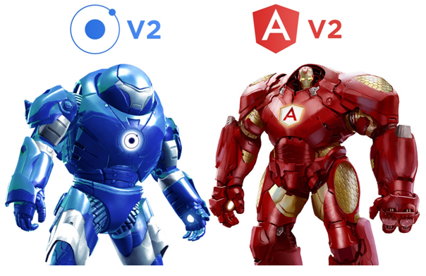
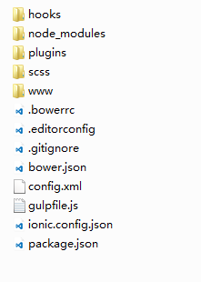
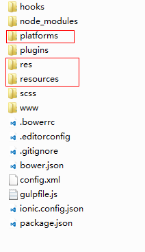
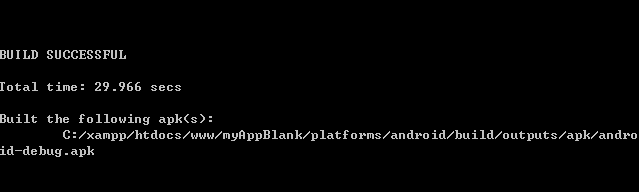

# Ionic框架主要技术介绍


## Cordova介绍
[Cordova官网](https://cordova.apache.org/)

Cordova提供了一组设备相关的API，通过这组API，移动应用能够以JavaScript访问原生的设备功能，如摄像头、麦克风等。
Cordova支持如下移动操作系统：iOS, Android,ubuntu phone os, Blackberry, Windows Phone, Palm WebOS, Bada 和 Symbian。

## Ng-cordova
[Ng-cordova](http://ngcordova.com/)

ngCordova是在Cordova Api基础上封装的一系列开源的AngularJs服务和指令扩展，让开发者可以方便的在HybridApp开发中调用设备能力，即可以在AngularJs代码中访问设备能力Api。

***

## Angular
[angular中文网](http://www.apjs.net/#dir310)

[angular官网](https://docs.angularjs.org/api/)

Angular最为核心的是：MVVM、模块化、自动化双向数据绑定、语义化标签、依赖注入等等。

**适用于：**
1. 单页面应用程序
2. Angular更适合于[CRUD](http://baike.baidu.com/link?url=pbhmsRjznfc6eHtRLEHu49KhgLusnW894oyWZ0VkQgummKRNX2FJOI_4wivLgpHrUp1K5Aq7CGz1cnwif0y0Pa)的管理系统开发。
3. 也非常适合模块化，分层化，数据绑定
4. hybrid开发神器

**Angular不适用于哪些场景？**
1. 内容网站，需要SEO的。(SEO目前也有了prerender解决方案)
2. 交互频繁的，如游戏之类交互体验网站。（单页面应用程序）
3. 太过于简单的页面。（因为要考虑mvc,注入等，就会笨重）

## Angular2
[Angular2 官网](https://angular.io/)

**Angular2新特性有哪些？**
1. 移动：新的版本将专注于移动应用的开发。依据是它更容易处理桌面方面的事情，一旦挑战涉及到移动（性能、加载时间），注重这方面会使问题得到解决。
2. 模块化：各个模块将从Angular的核心中移除，从而获得更好的性能。这意味着你可以选择你需要的零件。
3. 现代化：Angular 2.0将把ES6和“常青”现代浏览器（自动更新到最新版本）作为目标。这意味着开发者可以专注于业务领域相关的代码。

***

## Ionic2
[Ionic2官网](http://ionic.io/2)




- [ionic官网](http://ionicframework.com/)
- [ionic中文网](http://www.ionic.wang/)


# **开发环境搭建**

## **系统环境的搭建：**
1. java [jdk](http://baike.baidu.com/link?url=eL7W6StpE9LqEIhdsyGYSBkjQ2IHTkE6pbHx_DFpTAtMaeo3rQIj1AG7OBwArtHZujTaE4IsNM86XqLyyCy2X_)
[下载地址](http://www.oracle.com/technetwork/cn/java/javase/downloads/jdk8-downloads-2133151-zhs.html)
2. Android [sdk](http://baike.baidu.com/link?url=sFQzVPtZLfw0aarcnnn-lyrdgS1HGcsAgDVSDHOPZIrAsVB7ePUkERkNCrt0lVTwOK8apWpkjLLrXL-IsM_MLjOd-HGKyNsaCjKmEXusZYS)
3. [Node](https://nodejs.org/en/)
4. 设置npm镜像源 
``` shell
npm config set registry http://registry.npm.taobao.org
```
5. 安装项目依赖
``` shell
$ npm install -g cordova 
$ npm install -g ionic 
```
***

## **创建项目**

### 创建项目 有三种模板可供选择。
``` shell
    $ ionic start myApp blank
    $ ionic start myApp tabs
    $ ionic start myApp sidemenu
    $ ionic start myApp  //默认是tabs样式。
```

## **添加项目平台**
``` shell
    $ ionic platform add android
```

## **打包**
``` shell
    $ ionic build  android
```


